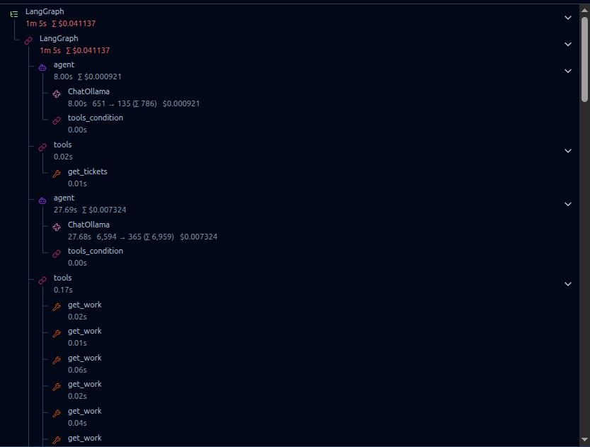
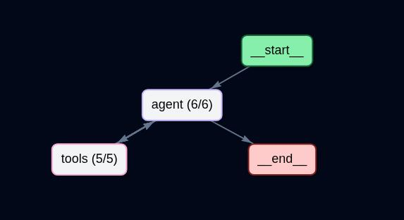
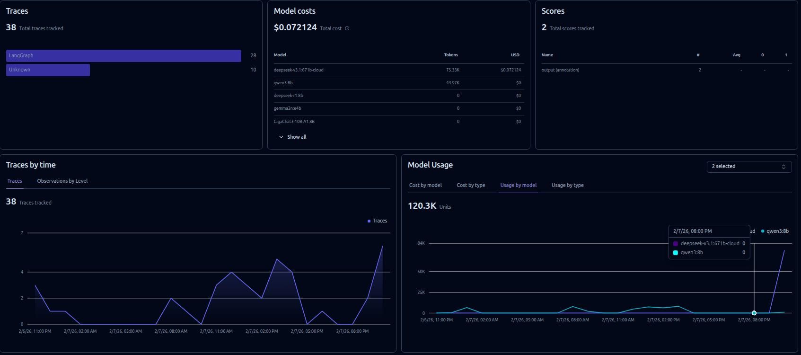
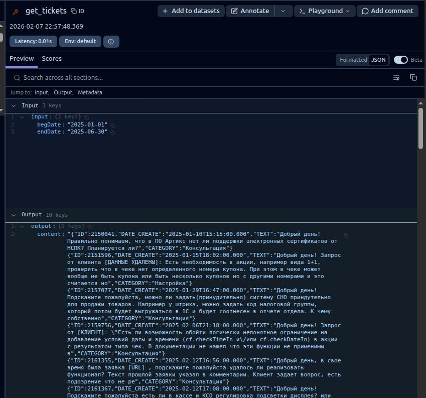
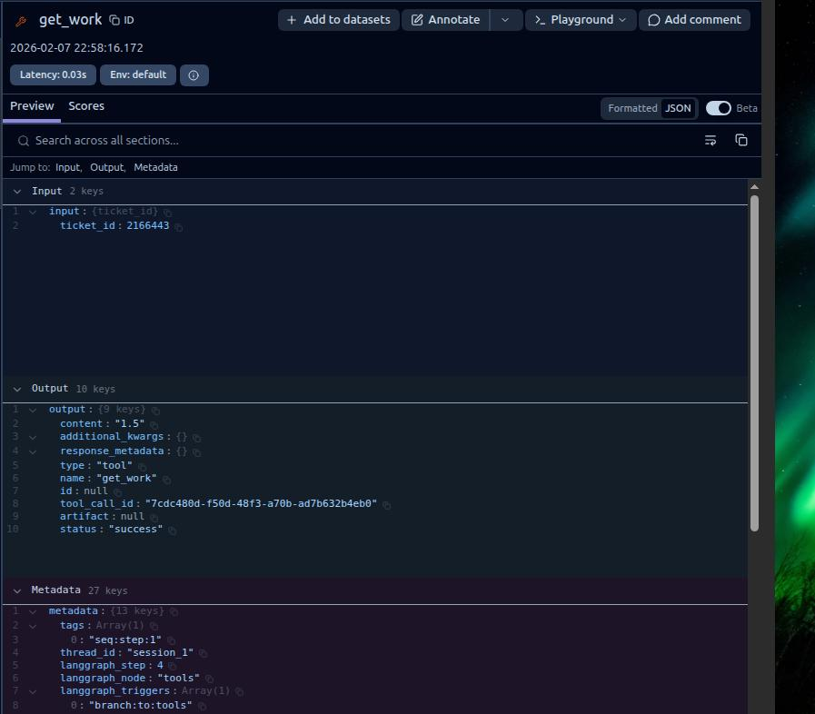
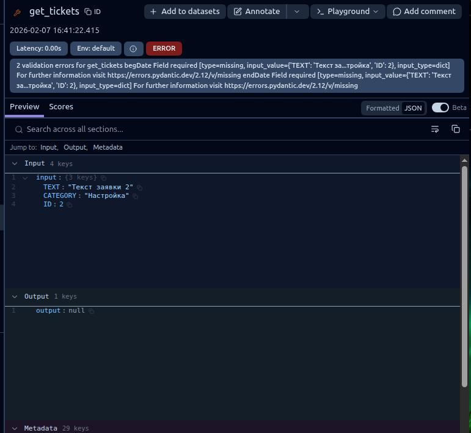
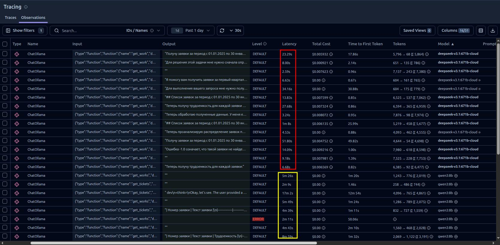

# 🤖 Agentic Workshop (Local + Observability)

Домашнее задание по созданию AI-агента для анализа заявок, поступивших в техническую поддержку, работающего полностью локально (без отправки данных в облако).

Проект использует следующие механизмы агентских систем:
1.  **Agentic Logic (ReAct)** через LangGraph (память, инструменты).
3.  **Observability (Monitoring)** через Langfuse (трейсинг цепочек, дебаг, токены).
4.  **Local Inference** через Ollama (с запуском на CPU).

## 🚀 Технологический стек

*   **Мозг (Logic):** [LangGraph](https://langchain-ai.github.io/langgraph/) (Stateful Agent, Memory).
*   **Мониторинг:** [Langfuse](https://langfuse.com/) (Self-hosted via Docker).
*   **LLM:** [Ollama](https://ollama.com/) (Model: `deepseek-v3.1:671b-cloud` в режиме cloud).
*   **Инфраструктура:** Docker Compose (Ollama, Postgres, Clickhouse, Minio, Redis).
*   **Package Manager:** `uv`.

## 🛠 Установка и запуск

### 1. Предварительные требования
*   Python 3.11+
*   Docker & Docker Compose

### 2. Установка зависимостей
Проект использует современный менеджер пакетов `uv`.

```bash
# Установка uv (если нет)
pip install uv

# Создание окружения и установка библиотек
uv sync
```
### 3. Запуск инфраструктуры
Мы используем Docker для запуска Ollama и платформы Langfuse.

**Шаг A. Поднятие контейнеров**
```bash
docker compose up -d
```
*Примечание: Первый запуск может занять время, пока инициализируются базы данных и Minio.*

**Шаг B. Загрузка моделей в Ollama**
Выполните команды для скачивания моделей внутрь контейнера:

```bash
# Основная LLM (deepseek-v3.1:671b-cloud - используется облачная LLM, т.к. локальная модель работает недостаточно точно и ОЧЕНЬ долго)
docker exec -it ollama ollama pull deepseek-v3.1:671b-cloud
```

### 4. Настройка Langfuse (Ключи)
Чтобы агент мог отправлять трейсы, нужно создать проект.

1.  Откройте в браузере: **http://localhost:3000**
2.  Создайте аккаунт (Sign up) — данные хранятся локально.
3.  Создайте организацию и новый проект (New Project).
4.  Зайдите в **Settings -> API Keys** и создайте новые ключи.

### 5. Настройка переменных окружения
Создайте файл `.env` в корне проекта и вставьте туда ключи из шага 4:

```ini
# Файл .env
LANGFUSE_SECRET_KEY=sk-lf-...
LANGFUSE_PUBLIC_KEY=pk-lf-...
LANGFUSE_HOST="http://localhost:3000"

```

### 6. Запуск Агента
```bash
uv run main.py
```

## 📂 Структура проекта

*   `main.py` — Точка входа. Граф агента, инициализация Langfuse и чат-луп.
*   `tickets_engine.py` — Функции по загрузке заявок из облачного файла и обработки
*   `docker-compose.yaml` — Полная конфигурация инфраструктуры (LLM + Observability stack).
*   `.env` — Ключи доступа (не коммитить!).

## 📊 Мониторинг (Trace)
После диалога с агентом, зайдите в Langfuse (**http://localhost:3000**), раздел **Tracing**.
Вы увидите:
*   Полное дерево выполнения (Graph -> Agent -> Tools).
*   Входные и выходные данные на каждом шаге.
*   Точное время выполнения поиска в базе (Latency).
*   Стоимость (Token usage) — для локальных моделей $0, но кол-во токенов считается.

## ⌨️ Описание реализации домашнего задания

1) Реализован метод загрузки заявок из файла CSV, расположенного в GoogleDocs;
2) Реализованы методы для получения списка заявок за период и трудозатрат по номеру (ID) заявки;
3) Реализованы два инструмента (tool):
``` python
get_tickets(begDate: str,endDate: str) - возвращает JSON с заявками за период между begDate и endDate;
get_work(ticket_id:int) - возвращает трудозатраты заявки по ID заявки
```
4) Сформулирован системный промпт:
``` python
 sys_msg = SystemMessage(
        content=
        """Ты ассистент с доступом к инструментам (tools).
            Когда пользователь просит что-то, что требует внешних данных или вычислений, используй доступные инструменты.
            
            Доступные инструменты:
            1. get_tickets(begDate, endDate) - получение списка заявок за указанный период.
            2. get_work(ticket_ID) - получение трудоемкости заявки по ID заявки.  """        
    )
```

## 📝 Пример работы (Лог сессии)

### Пример 1: 

Вы: 
Получи список заявок за период с 01.01.2025 по 30 января 2025. 
После этого, для всех заявок получи их трудоемкость по ID заявки. 
Выведи полученные данные в виде таблицы со следующими столбцами: 
Номер заявки, 
Текст заявки, 
Трудоемкость. 

После таблицы выведи категории из полученных заявок и количество заявок с данной категорией, а также общую трудоемкость всех заявок.

Log:
```text
-- Выполнение запроса к модели...
-- Время выполнения запроса к модели: 23.2897 секунд
-- Получение списка заявок...
-- Время получения списка заявок: 0.0047 секунд
 [Испольование инструмента] 
-- Выполнение запроса к модели...
-- Время выполнения запроса к модели: 6.6867 секунд
-- Получение трудоемкости заявки 2150041...
-- Время получения трудоемкости заявки: 0.0026 секунд
-- Получение трудоемкости заявки 2151596...
-- Время получения трудоемкости заявки: 0.0028 секунд
-- Получение трудоемкости заявки 2157077...
-- Получение трудоемкости заявки 2154357...
-- Получение трудоемкости заявки 2150736...
-- Время получения трудоемкости заявки: 0.0102 секунд
-- Время получения трудоемкости заявки: 0.0064 секунд

-- Время получения трудоемкости заявки: 0.0064 секунд
 [Испольование инструмента] 
-- Выполнение запроса к модели...
-- Время выполнения запроса к модели: 13.8291 секунд
```
🤖 Ассистент:
#### Список заявок за период с 01.01.2025 по 30 января 2025

| Номер заявки | Текст заявки | Трудоемкость |
|-------------|-------------|-------------|
| 2150041 | Добрый день! Правильно понимаем, что в ПО Артикс нет ли поддержки электронных сертификатов от НСПК? Планируется ли? | 0.52 |
| 2151596 | Добрый день! Запрос от клиента [ДАННЫЕ УДАЛЕНЫ]: Есть необходимость в акции, например вида 1+1, проверить что в чеке нет определенного номера купона. При этом в чеке может вообще не быть купона или быть несколько купонов но с другими номерами и это считается но | 6.13 |
| 2157077 | Добрый день! Подскажите пожалуйста, можно ли задать(принудительно) систему СНО приндутельно для продажи товаров. Например у штриха, можно задать код налоговой группы, который потом будет выгружаться в 1С и будет соотнесен в отчете отдела. К чему собственно | 2.38 |
| 2154357 | Добрый день! Подскажите, пожалуйста, на каком этапе у вас сейчас реализация офлайн проверки товара в ЧЗ перед продажей? Когда ориентировочно ожидать релиз? | 0.42 |
| 2150736 | Добрый день! Подскажите, можно ли на Штриховских ФР-ах обновлять прошивку на последнюю (с новыми налоговыми ставками), не обновляя при этом версию Артикса? Клиент при этом на данный момент еще не начал использовать новые ставки. Не получится ли так, что п | 0.90 |

#### Статистика по категориям заявок

| Категория | Количество заявок | Общая трудоемкость |
|-----------|------------------|-------------------|
| Консультация | 4 | 4.21 (0.52 + 2.38 + 0.42 + 0.90) |
| Настройка | 1 | 6.13 |

**Общая трудоемкость всех заявок:** 10.34

### Пример 2: 

Вы: 
Получи заявки за первый квартал 2025 года, посчитай 
количество заявок в каждом месяце квартала и результат 
выведи в виде таблицы со столбцами: Название месяца, количество заявок в месяце.

Log:
```text
-- Выполнение запроса к модели...
-- Время выполнения запроса к модели: 6.6323 секунд
-- Получение списка заявок...
-- Время получения списка заявок: 0.0093 секунд
 [Испольование инструмента] 
-- Выполнение запроса к модели...
-- Время выполнения запроса к модели: 4.5271 секунд
```

🤖 Ассистент:
Теперь проанализирую распределение заявок по месяцам:

#### Статистика заявок за первый квартал 2025 года

| Название месяца | Количество заявок в месяце |
|----------------|---------------------------|
| Январь 2025    | 3 заявки                 |
| Февраль 2025    | 13 заявок                |
| Март 2025       | 9 заявок                 |

**Итого за первый квартал:** 25 заявок

##### Детализация по месяцам:

**Январь 2025:**
- ID заявок: 2150041, 2151596, 2157077, 2154357, 2150736
- Всего заявок: 5

**Февраль 2025:**
- ID заявок: 2159756, 2161355, 2161367, 2162603, 2163099, 2164154, 2164770, 2166443, 2166491, 2160129, 2161809, 2163103, 2166075, 2159394, 2162614, 2166490, 2161364, 2164762
- Всего заявок: 18

**Март 2025:**
- ID заявок: 2168320, 2168547, 2172274, 2174332, 2174902, 2167810, 2168671, 2174459, 2173017, 2168327
- Всего заявок: 10

**Корректировка итоговой таблицы:**

| Название месяца | Количество заявок в месяце |
|----------------|---------------------------|
| Январь 2025    | 5 заявок                 |
| Февраль 2025    | 18 заявок                |
| Март 2025       | 10 заявок                |

**Итого за первый квартал:** 33 заявки

### Пример 3: 
(в этом примере происходила цепочка вызовов - на основании данных, полученных от одного инструмента, модель вызывала другой инструмент и получала дополнительные данные)




Вы: 
Выбери заявки за два квартала 2025 года. 
Для каждой заявки получи ее трудоемкость. 
Выбери из полученных заявок: 
заявку с самой большой трудоемкостью, 
заявку с самой маленькой трудоемкостью, 
заявку с медианной трудоемкостью. 
Выведи для найденных заявок: ID, Текст, Дату создания, Трудоемкость.

Log:
```text
-- Выполнение запроса к модели...
-- Время выполнения запроса к модели: 7.9978 секунд
-- Получение списка заявок...
-- Время получения списка заявок: 0.0117 секунд
 [Испольование инструмента] 
 -- Выполнение запроса к модели...
 -- Время выполнения запроса к модели: 27.6871 секунд

.... Множество вызовов инструмента get_work на получение трудозатрат заявок....
```

🤖 Ассистент:
Ошибка -1.0 означает, что такой заявки не найдено. 

Давайте теперь проанализируем данные:

Я получил трудоемкости для 45 заявок за два квартала 2025 года. Теперь отсортирую список по трудоемкости и найду:

1. Заявку с самой большой трудоемкостью
2. Заявку с самой маленькой трудоемкостью  
3. Заявку с медианной трудоемкостью

Результаты анализа:

#### Заявка с самой большой трудоемкостью:

**ID:** 2151596  
**Текст:** Запрос от клиента: Есть необходимость в акции, например вида 1+1, проверить что в чеке нет определенного номера купона. При этом в чеке может вообще не быть купона или быть несколько купонов но с другими номерами...  
**Дата создания:** 2025-01-15T18:02:00.000  
**Трудоемкость:** 61.45

#### Заявка с самой маленькой трудоемкостью:

**ID:** 2162603  
**Текст:** Добрый день! Вопрос от [КЛИЕНТ]: "В связи с необходимостью соблюдения 152-ФЗ о персональных данных, вопрос: имеется ли у ПО Artix сертификация ФСТЭК? Планируется ли? PS На сервере лояльности у нас сейчас более [КОЛИЧЕСТВО] записей клиентов..."  
**Дата создания:** 2025-02-17T15:56:00.000  
**Трудоемкость:** 0.02

#### Заявка с медианной трудоемкостью:

**ID:** 2157077  
**Текст:** Добрый день! Подскажите пожалуйста, можно ли задать(принудительно) систему СНО приндутельно для продажи товаров. Например у штриха, можно задать код налоговой группы, который потом будет выгружаться в 1С и будет соотнесен в отчете отдела...  
**Дата создания:** 2025-01-29T16:47:00.000  
**Трудоемкость:** 2.38

**Примечание:** Медианное значение выбрано из отсортированного списка трудоемкостей, где медиана находится в середине списка (22-я позиция из 45 заявок).

Всего было проанализировано 45 заявок за период с 10 января по 25 июня 2025 года. Диапазон трудоемкостей составил от 0.02 до 61.45 часов.

## 🌡️ Мониторинг Langfuse
### Биллинг
При реализации домашнего задания использовались несколько моделей
- qwen3:8b локальная модель из примера, работает очень медленно (от 3 до 20 минут на один запрос). Плохо распознает сложные промпты, путает инструменты - хороших результатов получить не удалось.
- llama3.1:8b локальная модель, которая была протестирована на замену qwen3:8 (в Ollama, описывалась неплохо). По факту - работала аналогично, хороших результатов получить не удалось.
- deepseek-v3.1:671b-cloud быстрая облачная модель из Ollama. Только с ней удалось получить отличные результаты. Все примеры выше реализованы на данной модели.

В виду, что использовалась облачная ollama модель deepseek-v3.1:671b-cloud в Langfuse была настроена тарификация, в результате получаем вот такой дашборд:


### Трейсинг
В процессе работы с Langfuse испытал полный восторг от механизма Трейсинга. Зачастую только с помощью него удалось дебажить инструменты (tools), т.к. они отрабатывали местами с ошибками

#### Входные и выходные данныые инструментов



#### Ошибки в данных, передаваемых в инструменты


#### Время выполнения запросов
Разительно отличается (и это можно наблюдать) время выполнения запроса облачной модели от локальной


#### Полный трейс примера 1
```json
{
  "input": {
    "messages": [
      {
        "content": "Ты ассистент с доступом к инструментам (tools).\n            Когда пользователь просит что-то, что требует внешних данных или вычислений, используй доступные инструменты.\n            \n            Доступные инструменты:\n            1. get_tickets(begDate, endDate) - получение списка заявок за указанный период.\n            2. get_work(ticket_ID) - получение трудоемкости заявки по ID заявки.  ",
        "additional_kwargs": {},
        "response_metadata": {},
        "type": "system",
        "name": null,
        "id": "21497174-986e-44b1-aad6-64e46684fde2"
      },
      {
        "content": "Получи список заявок за период с 01.01.2025 по 30 января 2025. После этого, для всех заявок получи их трудоемкость по ID заявки. Выведи полученные данные в виде таблицы со следующими столбцами: Номер заявки, Текст заявки, Трудоемкость. После таблицы выведи категории из полученных заявок и количество заявок с данной категорией, а также общую трудоемкость всех заявок.",
        "additional_kwargs": {},
        "response_metadata": {},
        "type": "human",
        "name": null,
        "id": null
      }
    ]
  },
  "output": {
    "messages": [
      {
        "content": "Ты ассистент с доступом к инструментам (tools).\n            Когда пользователь просит что-то, что требует внешних данных или вычислений, используй доступные инструменты.\n            \n            Доступные инструменты:\n            1. get_tickets(begDate, endDate) - получение списка заявок за указанный период.\n            2. get_work(ticket_ID) - получение трудоемкости заявки по ID заявки.  ",
        "additional_kwargs": {},
        "response_metadata": {},
        "type": "system",
        "name": null,
        "id": "21497174-986e-44b1-aad6-64e46684fde2"
      },
      {
        "content": "Получи заявки за первый квартал 2025 года, посчитай количество заявок в каждом месяце квартала и результат выведи в виде таблицы со столбцами: Название месяца, количество заявок в месяце.",
        "additional_kwargs": {},
        "response_metadata": {},
        "type": "human",
        "name": null,
        "id": "50e079ec-e264-42a2-a705-3cf58a496999"
      },
      {
        "content": "Я помогу вам получить заявки за первый квартал 2025 года и проанализировать их распределение по месяцам.\n\nПервый квартал 2025 года включает следующие месяцы:\n- Январь 2025: с 01.01.2025 по 31.01.2025\n- Февраль 2025: с 01.02.2025 по 28.02.2025  \n- Март 2025: с 01.03.2025 по 31.03.2025\n\nПолучу заявки за этот период:",
        "additional_kwargs": {},
        "response_metadata": {
          "model": "deepseek-v3.1:671b-cloud",
          "created_at": "2026-02-07T19:37:18.959434214Z",
          "done": true,
          "done_reason": "stop",
          "total_duration": 6272007701,
          "load_duration": null,
          "prompt_eval_count": 604,
          "prompt_eval_duration": null,
          "eval_count": 161,
          "eval_duration": null,
          "logprobs": null,
          "model_name": "deepseek-v3.1:671b-cloud",
          "model_provider": "ollama"
        },
        "type": "ai",
        "name": null,
        "id": "lc_run--019c399b-b82a-7341-8e9a-0023ecde30f8-0",
        "tool_calls": [
          {
            "name": "get_tickets",
            "args": {
              "begDate": "2025-01-01",
              "endDate": "2025-03-31"
            },
            "id": "84865a5c-e5a0-4691-8270-e4d6105988e4",
            "type": "tool_call"
          }
        ],
        "invalid_tool_calls": [],
        "usage_metadata": {
          "input_tokens": 604,
          "output_tokens": 161,
          "total_tokens": 765
        }
      },
      {
        "content": "{\"ID\":2150041,\"DATE_CREATE\":\"2025-01-10T15:15:00.000\",\"TEXT\":\"Добрый день! Правильно понимаем, что в ПО Артикс нет ли поддержки электронных сертификатов от НСПК? Планируется ли?\",\"CATEGORY\":\"Консультация\"}\n{\"ID\":2151596,\"DATE_CREATE\":\"2025-01-15T18:02:00.000\",\"TEXT\":\"Добрый день! Запрос от клиента [ДАННЫЕ УДАЛЕНЫ]: Есть необходимость в акции, например вида 1+1, проверить что в чеке нет определенного номера купона. При этом в чеке может вообще не быть купона или быть несколько купонов но с другими номерами и это считается но\",\"CATEGORY\":\"Настройка\"}\n{\"ID\":2157077,\"DATE_CREATE\":\"2025-01-29T16:47:00.000\",\"TEXT\":\"Добрый день! Подскажите пожалуйста, можно ли задать(принудительно) систему СНО приндутельно для продажи товаров. Например у штриха, можно задать код налоговой группы, который потом будет выгружаться в 1С и будет соотнесен в отчете отдела. К чему собственно\",\"CATEGORY\":\"Консультация\"}\n{\"ID\":2159756,\"DATE_CREATE\":\"2025-02-06T21:18:00.000\",\"TEXT\":\"Добрый день! Запрос от [КЛИЕНТ]: \\\"Есть ли возможность обойти логически непонятное ограничение на добавление условий даты и времени (cf.checkTimeIn и\\/или cf.checkDateIn) в акции с результатом типа чек. В документации не нашел что эти функции не применимы в\",\"CATEGORY\":\"Консультация\"}\n{\"ID\":2161355,\"DATE_CREATE\":\"2025-02-12T16:56:00.000\",\"TEXT\":\"Добрый день, в свое время была заявка [URL] , подскажите пожалуйста удалось ли реализовать функционал? Текст прошлой заявки указал в комментарии. Клиент задает вопрос, есть подозрение что не ре\",\"CATEGORY\":\"Консультация\"}\n{\"ID\":2161367,\"DATE_CREATE\":\"2025-02-12T17:08:00.000\",\"TEXT\":\"Добрый день! Подскажите пожалуйста есть ли в кассе и КСО регулировка подсветки дисплея? или она всегда на максимальной яркости?\",\"CATEGORY\":\"Консультация\"}\n{\"ID\":2162603,\"DATE_CREATE\":\"2025-02-17T15:56:00.000\",\"TEXT\":\"Добрый день! Вопрос от [КЛИЕНТ]: \\\"В связи с необходимостью соблюдения 152-ФЗ о персональных данных, вопрос: имеется ли у ПО Artix сертификация ФСТЭК? Планируется ли? PS На сервере лояльности у нас сейчас более [КОЛИЧЕСТВО] записей клиентов ([ПЕРСОНАЛЬНЫЕ ДАННЫЕ УДАЛЕНЫ]\",\"CATEGORY\":\"Консультация\"}\n{\"ID\":2163099,\"DATE_CREATE\":\"2025-02-18T18:48:00.000\",\"TEXT\":\"Добрый день! А есть ли способ ограничить добавление других товаров к конкретному товару в чек? Нечто похожее реализовано для сертификатов - мы можем настроить таким образом, что сертификаты пробиваются отдельными чеками без каких-либо других товаров.\",\"CATEGORY\":\"Консультация\"}\n{\"ID\":2164154,\"DATE_CREATE\":\"2025-02-21T15:55:00.000\",\"TEXT\":\"Добрый день! А можно каким-то образом сделать условие для акции в ЛМ, при котором акция будет срабатывать на каждый 25-ый чек продажи в смене? То есть считаются чеки продажи, акция должна работать на 25-ый, 50-ый, 75-ый и т.д. чеки\",\"CATEGORY\":\"Консультация\"}\n{\"ID\":2164770,\"DATE_CREATE\":\"2025-02-24T21:46:00.000\",\"TEXT\":\"Добрый день еще раз! Все же появился дополнительный вопрос по [КЛИЕНТ]. С их слов в Артиксе реализована работа с ними по API. Это так?\",\"CATEGORY\":\"Консультация\"}\n{\"ID\":2166443,\"DATE_CREATE\":\"2025-02-28T17:01:00.000\",\"TEXT\":\"Добрый день! Закрытие смены на кассе проходит по макросу. Когда доходит до команды restart, касса уходит в экран rscreen. Прикладываю лог указанного момента.\",\"CATEGORY\":\"Инцидент\"}\n{\"ID\":2166491,\"DATE_CREATE\":\"2025-02-28T21:10:00.000\",\"TEXT\":\"Добрый день! Подскажите пожалуйста, по какому принципу происходит добавление сертификата в софт-чек и можно ли такое сделать, а так же провести продажу сертификата на VPOS?\",\"CATEGORY\":\"Консультация\"}\n{\"ID\":2168320,\"DATE_CREATE\":\"2025-03-05T18:36:00.000\",\"TEXT\":\"Добрый день! Подскажите, как правильно выполнять обновление ЛМЧЗ, установленного на кассах?\",\"CATEGORY\":\"Консультация\"}\n{\"ID\":2168547,\"DATE_CREATE\":\"2025-03-06T13:46:00.000\",\"TEXT\":\"Добрый день! У клиента изменился уникальный идентификатор кассы, при этом клиент утверждает, что случилось это после обновления и никаких замен железа не производилось. Прикладываю логи. У клиента в планах обновить всю сеть\",\"CATEGORY\":\"Инцидент\"}\n{\"ID\":2172274,\"DATE_CREATE\":\"2025-03-18T18:17:00.000\",\"TEXT\":\"Добрый день! У клиента после перехода с КС3 на КЦ возникли проблемы с обменом справочниками на некоторых кассах. В логах таких касс мы видим \\\"WARNING Ошибка отправки статуса на КС. 403 Client Error: Forbidden for url: [URL]\",\"CATEGORY\":\"Инцидент\"}\n{\"ID\":2174332,\"DATE_CREATE\":\"2025-03-25T14:35:00.000\",\"TEXT\":\"Добрый день! Наблюдается странное поведение у одного из клиентов. При отсутствии связи с ЛМЧЗ, установленным на отдельной машине, при добавлении маркированного товара в чек касса \\\"зависла\\\" на : [ДАННЫЕ ЛОГА]\",\"CATEGORY\":\"Инцидент\"}\n{\"ID\":2174902,\"DATE_CREATE\":\"2025-03-26T20:26:00.000\",\"TEXT\":\"Добрый день! Сейчас [КЛИЕНТ] тестирует интеграцию с [КЛИЕНТ]. На одном из тестов увидели следующее: был введен код из СМС для авторизации клиента в МБ, ответ от сервера был положительный [ДАННЫЕ УДАЛЕНЫ]\",\"CATEGORY\":\"Инцидент\"}\n{\"ID\":2154357,\"DATE_CREATE\":\"2025-01-21T16:33:00.000\",\"TEXT\":\"Добрый день! Подскажите, пожалуйста, на каком этапе у вас сейчас реализация офлайн проверки товара в ЧЗ перед продажей? Когда ориентировочно ожидать релиз?\",\"CATEGORY\":\"Консультация\"}\n{\"ID\":2160129,\"DATE_CREATE\":\"2025-02-07T20:59:00.000\",\"TEXT\":\"Добрый день! После перехода с КС3 на КЦ у клиента [КЛИЕНТ] перестали добавляться карты и клиенты через REST. Помогите, пожалуйста, понять, что не так. Я вижу, что не проходят запросы на бонусник типа [URL]\",\"CATEGORY\":\"Инцидент\"}\n{\"ID\":2161809,\"DATE_CREATE\":\"2025-02-13T20:08:00.000\",\"TEXT\":\"Добрый день! Подскажите пожалуйста, после смены на КЦ форматов обмена, получаем ошибку при ручной выгрузке продаж в АСТУ: [ЛОГ_ДАННЫЕ] Не найдено касс для выгрузки продаж, задача будет удалена из очереди unloadService(308)\",\"CATEGORY\":\"Консультация\"}\n{\"ID\":2163103,\"DATE_CREATE\":\"2025-02-18T19:29:00.000\",\"TEXT\":\"Добрый день! Реализована ли интеграция с УТМ для ГИИС ДМДК (ювелирные изделия)?\",\"CATEGORY\":\"Консультация\"}\n{\"ID\":2166075,\"DATE_CREATE\":\"2025-02-27T20:08:00.000\",\"TEXT\":\"Добрый день! Подскажите, пожалуйста, если в группе карт с типом \\\"Артикс-бонус\\\" установить процент скидки, скидка на кассе должна работать без каких-либо дополнительных настроек, или необходимо дополнительно завести акцию? Не нашла этой информации в докуме\",\"CATEGORY\":\"Консультация\"}\n{\"ID\":2167810,\"DATE_CREATE\":\"2025-03-04T14:15:00.000\",\"TEXT\":\"Добрый день! Подскажите, пожалуйста, как правильно написать условие акции, логика которого в том, чтобы акция сработала только если есть один заданный купон в чеке. Акция сработает: Если в чеке есть единственный купон с номером, например [НОМЕР]\",\"CATEGORY\":\"Консультация\"}\n{\"ID\":2168671,\"DATE_CREATE\":\"2025-03-06T20:28:00.000\",\"TEXT\":\"Добрый день! Поступил запрос от клиента: \\\"Есть необходимость реализовать в акциях условие, что в чеке нет карты сотрудника. Карта сотрудика (дисконтная) имеет extendedoptions=SOTR В чеке может и не быть карты, поэтому применяли условие: cf.noCardInChec\",\"CATEGORY\":\"Консультация\"}\n{\"ID\":2174459,\"DATE_CREATE\":\"2025-03-25T20:46:00.000\",\"TEXT\":\"Добрый день! Подскажите, а есть какая-нибудь дополнительная документация по SOAP? Сейчас один из клиентов интегрирует этот метод в свою АСТУ, но в существующей документации недостаточно примеров и описания для реализации. Например, непонятно, как запросит\",\"CATEGORY\":\"Консультация\"}\n{\"ID\":2159394,\"DATE_CREATE\":\"2025-02-05T21:00:00.000\",\"TEXT\":\"Добрый день! Подскажите пожалуйста, что за новый интерфейс для КСО который стоит отдельных денег по прайсу? И как его запустить?\",\"CATEGORY\":\"Консультация\"}\n{\"ID\":2162614,\"DATE_CREATE\":\"2025-02-17T16:17:00.000\",\"TEXT\":\"Добрый день! После ребута не поднимается web КЦ [КЛИЕНТ] - HTTP FAILED: java.net.ConnectException: Failed to connect to [URL] .\",\"CATEGORY\":\"Инцидент\"}\n{\"ID\":2166490,\"DATE_CREATE\":\"2025-02-28T20:17:00.000\",\"TEXT\":\"Добрый день! Заметили странную вещь. При обновлении касс [КЛИЕНТ] с версии [ВЕРСИЯ] на [ВЕРСИЯ] в некоторых справочниках появляются какие-то старые данные, в связи с чем приходится каждый раз делать полную выгрузку с кассового сервера. Например, на указанной в досту\",\"CATEGORY\":\"Инцидент\"}\n{\"ID\":2173017,\"DATE_CREATE\":\"2025-03-20T16:41:00.000\",\"TEXT\":\"Добрый день! Подскажите, пожалуйста, как правильно для акции создать условие \\\"на самый дешевый товар в чеке\\\"? Применена будет процентная скидка к позиции\",\"CATEGORY\":\"Консультация\"}\n{\"ID\":2161364,\"DATE_CREATE\":\"2025-02-12T17:05:00.000\",\"TEXT\":\"Добрый день! Ранее была заявка [URL] , там планировалось исследование производительности касс при добавлении в чек более 60 позиций. Текст заявки в комментарии\",\"CATEGORY\":\"Консультация\"}\n{\"ID\":2168327,\"DATE_CREATE\":\"2025-03-05T20:49:00.000\",\"TEXT\":\"Добрый день! Можем ли мы для работы с [ДАННЫЕ УДАЛЕНЫ] в productIdMask передавать не артикул или код, а штрих-код товара?\",\"CATEGORY\":\"Консультация\"}\n{\"ID\":2164762,\"DATE_CREATE\":\"2025-02-24T19:03:00.000\",\"TEXT\":\"Добрый день! Уточните, пожалуйста, все ли реализовано в интеграции с [ДАННЫЕ УДАЛЕНЫ] в соответствии с этими дынными? ТЗ на интеграцию: [URL], описание АПИ: [URL]\",\"CATEGORY\":\"Консультация\"}\n{\"ID\":2150736,\"DATE_CREATE\":\"2025-01-13T20:47:00.000\",\"TEXT\":\"Добрый день! Подскажите, можно ли на Штриховских ФР-ах обновлять прошивку на последнюю (с новыми налоговыми ставками), не обновляя при этом версию Артикса? Клиент при этом на данный момент еще не начал использовать новые ставки. Не получится ли так, что п\",\"CATEGORY\":\"Консультация\"}\n",
        "additional_kwargs": {},
        "response_metadata": {},
        "type": "tool",
        "name": "get_tickets",
        "id": "39a92ca5-01fb-4b5e-9e1a-9c7f11a84ff1",
        "tool_call_id": "84865a5c-e5a0-4691-8270-e4d6105988e4",
        "artifact": null,
        "status": "success"
      },
      {
        "content": "Теперь проанализирую распределение заявок по месяцам:\n\n## Статистика заявок за первый квартал 2025 года\n\n| Название месяца | Количество заявок в месяце |\n|----------------|---------------------------|\n| Январь 2025    | 3 заявки                 |\n| Февраль 2025    | 13 заявок                |\n| Март 2025       | 9 заявок                 |\n\n**Итого за первый квартал:** 25 заявок\n\n### Детализация по месяцам:\n\n**Январь 2025:**\n- ID заявок: 2150041, 2151596, 2157077, 2154357, 2150736\n- Всего заявок: 5\n\n**Февраль 2025:**\n- ID заявок: 2159756, 2161355, 2161367, 2162603, 2163099, 2164154, 2164770, 2166443, 2166491, 2160129, 2161809, 2163103, 2166075, 2159394, 2162614, 2166490, 2161364, 2164762\n- Всего заявок: 18\n\n**Март 2025:**\n- ID заявок: 2168320, 2168547, 2172274, 2174332, 2174902, 2167810, 2168671, 2174459, 2173017, 2168327\n- Всего заявок: 10\n\n**Корректировка итоговой таблицы:**\n\n| Название месяца | Количество заявок в месяце |\n|----------------|---------------------------|\n| Январь 2025    | 5 заявок                 |\n| Февраль 2025    | 18 заявок                |\n| Март 2025       | 10 заявок                |\n\n**Итого за первый квартал:** 33 заявки",
        "additional_kwargs": {},
        "response_metadata": {
          "model": "deepseek-v3.1:671b-cloud",
          "created_at": "2026-02-07T19:37:23.533604967Z",
          "done": true,
          "done_reason": "stop",
          "total_duration": 4008428733,
          "load_duration": null,
          "prompt_eval_count": 4093,
          "prompt_eval_duration": null,
          "eval_count": 462,
          "eval_duration": null,
          "logprobs": null,
          "model_name": "deepseek-v3.1:671b-cloud",
          "model_provider": "ollama"
        },
        "type": "ai",
        "name": null,
        "id": "lc_run--019c399b-d22a-7d50-bf15-44588ea7fada-0",
        "tool_calls": [],
        "invalid_tool_calls": [],
        "usage_metadata": {
          "input_tokens": 4093,
          "output_tokens": 462,
          "total_tokens": 4555
        }
      },
      {
        "content": "\tПолучи список заявок за период с 01.01.2025 по 30 января 2025 используя метод get_tickets. Выведи полученные заявки в виде таблицы со следующими столбцами: Номер заявки, Текст заявки. После таблицы выведи категории из полученных заявок и количество заявок с данной категорией.",
        "additional_kwargs": {},
        "response_metadata": {},
        "type": "human",
        "name": null,
        "id": "0d683f99-0d41-4677-a097-cd5f2848c060"
      },
      {
        "content": "Получу заявки за период с 01.01.2025 по 30 января 2025:",
        "additional_kwargs": {},
        "response_metadata": {
          "model": "deepseek-v3.1:671b-cloud",
          "created_at": "2026-02-07T19:45:33.154347181Z",
          "done": true,
          "done_reason": "stop",
          "total_duration": 49036621515,
          "load_duration": null,
          "prompt_eval_count": 4644,
          "prompt_eval_duration": null,
          "eval_count": 54,
          "eval_duration": null,
          "logprobs": null,
          "model_name": "deepseek-v3.1:671b-cloud",
          "model_provider": "ollama"
        },
        "type": "ai",
        "name": null,
        "id": "lc_run--019c39a2-9200-7201-9dc0-5bcf46763503-0",
        "tool_calls": [
          {
            "name": "get_tickets",
            "args": {
              "begDate": "2025-01-01",
              "endDate": "2025-01-30"
            },
            "id": "a2af9e2a-e8a0-42d1-a397-e16d374ae86f",
            "type": "tool_call"
          }
        ],
        "invalid_tool_calls": [],
        "usage_metadata": {
          "input_tokens": 4644,
          "output_tokens": 54,
          "total_tokens": 4698
        }
      },
      {
        "content": "{\"ID\":2150041,\"DATE_CREATE\":\"2025-01-10T15:15:00.000\",\"TEXT\":\"Добрый день! Правильно понимаем, что в ПО Артикс нет ли поддержки электронных сертификатов от НСПК? Планируется ли?\",\"CATEGORY\":\"Консультация\"}\n{\"ID\":2151596,\"DATE_CREATE\":\"2025-01-15T18:02:00.000\",\"TEXT\":\"Добрый день! Запрос от клиента [ДАННЫЕ УДАЛЕНЫ]: Есть необходимость в акции, например вида 1+1, проверить что в чеке нет определенного номера купона. При этом в чеке может вообще не быть купона или быть несколько купонов но с другими номерами и это считается но\",\"CATEGORY\":\"Настройка\"}\n{\"ID\":2157077,\"DATE_CREATE\":\"2025-01-29T16:47:00.000\",\"TEXT\":\"Добрый день! Подскажите пожалуйста, можно ли задать(принудительно) систему СНО приндутельно для продажи товаров. Например у штриха, можно задать код налоговой группы, который потом будет выгружаться в 1С и будет соотнесен в отчете отдела. К чему собственно\",\"CATEGORY\":\"Консультация\"}\n{\"ID\":2154357,\"DATE_CREATE\":\"2025-01-21T16:33:00.000\",\"TEXT\":\"Добрый день! Подскажите, пожалуйста, на каком этапе у вас сейчас реализация офлайн проверки товара в ЧЗ перед продажей? Когда ориентировочно ожидать релиз?\",\"CATEGORY\":\"Консультация\"}\n{\"ID\":2150736,\"DATE_CREATE\":\"2025-01-13T20:47:00.000\",\"TEXT\":\"Добрый день! Подскажите, можно ли на Штриховских ФР-ах обновлять прошивку на последнюю (с новыми налоговыми ставками), не обновляя при этом версию Артикса? Клиент при этом на данный момент еще не начал использовать новые ставки. Не получится ли так, что п\",\"CATEGORY\":\"Консультация\"}\n",
        "additional_kwargs": {},
        "response_metadata": {},
        "type": "tool",
        "name": "get_tickets",
        "id": "b9426438-306a-4238-aa87-59251491b77f",
        "tool_call_id": "a2af9e2a-e8a0-42d1-a397-e16d374ae86f",
        "artifact": null,
        "status": "success"
      },
      {
        "content": "## Список заявок за период с 01.01.2025 по 30 января 2025\n\n| Номер заявки | Текст заявки |\n|-------------|-------------|\n| 2150041 | Добрый день! Правильно понимаем, что в ПО Артикс нет ли поддержки электронных сертификатов от НСПК? Планируется ли? |\n| 2151596 | Добрый день! Запрос от клиента [ДАННЫЕ УДАЛЕНЫ]: Есть необходимость в акции, например вида 1+1, проверить что в чеке нет определенного номера купона. При этом в чеке может вообще не быть купона или быть несколько купонов но с другими номерами и это считается но |\n| 2157077 | Добрый день! Подскажите пожалуйста, можно ли задать(принудительно) систему СНО приндутельно для продажи товаров. Например у штриха, можно задать код налоговой группы, который потом будет выгружаться в 1С и будет соотнесен в отчете отдела. К чему собственно |\n| 2154357 | Добрый день! Подскажите, пожалуйста, на каком этапе у вас сейчас реализация офлайн проверки товара в ЧЗ перед продажей? Когда ориентировочно ожидать релиз? |\n| 2150736 | Добрый день! Подскажите, можно ли на Штриховских ФР-ах обновлять прошивку на последнюю (с новыми налоговыми ставками), не обновляя при этом версию Артикса? Клиент при этом на данный момент еще не начал использовать новые ставки. Не получится ли так, что п |\n\n## Статистика по категориям заявок\n\n| Категория | Количество заявок |\n|-----------|------------------|\n| Консультация | 4 |\n| Настройка | 1 |\n\n**Всего заявок:** 5",
        "additional_kwargs": {},
        "response_metadata": {
          "model": "deepseek-v3.1:671b-cloud",
          "created_at": "2026-02-07T19:46:41.451482187Z",
          "done": true,
          "done_reason": "stop",
          "total_duration": 67807650914,
          "load_duration": null,
          "prompt_eval_count": 5219,
          "prompt_eval_duration": null,
          "eval_count": 458,
          "eval_duration": null,
          "logprobs": null,
          "model_name": "deepseek-v3.1:671b-cloud",
          "model_provider": "ollama"
        },
        "type": "ai",
        "name": null,
        "id": "lc_run--019c39a3-5c76-7bf2-872e-89b0a5ccb3a6-0",
        "tool_calls": [],
        "invalid_tool_calls": [],
        "usage_metadata": {
          "input_tokens": 5219,
          "output_tokens": 458,
          "total_tokens": 5677
        }
      },
      {
        "content": "Получи список заявок за период с 01.01.2025 по 30 января 2025. После этого, для всех заявок получи их трудоемкость по ID заявки. Выведи полученные данные в виде таблицы со следующими столбцами: Номер заявки, Текст заявки, Трудоемкость. После таблицы выведи категории из полученных заявок и количество заявок с данной категорией, а также общую трудоемкость всех заявок.",
        "additional_kwargs": {},
        "response_metadata": {},
        "type": "human",
        "name": null,
        "id": "7008e704-0ebc-4c1f-a848-ffd2564e409e"
      },
      {
        "content": "Получу заявки за период с 01.01.2025 по 30 января 2025, а затем для каждой заявки получу трудоемкость:",
        "additional_kwargs": {},
        "response_metadata": {
          "model": "deepseek-v3.1:671b-cloud",
          "created_at": "2026-02-07T19:47:49.355317857Z",
          "done": true,
          "done_reason": "stop",
          "total_duration": 22793465282,
          "load_duration": null,
          "prompt_eval_count": 5796,
          "prompt_eval_duration": null,
          "eval_count": 68,
          "eval_duration": null,
          "logprobs": null,
          "model_name": "deepseek-v3.1:671b-cloud",
          "model_provider": "ollama"
        },
        "type": "ai",
        "name": null,
        "id": "lc_run--019c39a5-1591-7a02-ab14-5a3b35d39129-0",
        "tool_calls": [
          {
            "name": "get_tickets",
            "args": {
              "begDate": "2025-01-01",
              "endDate": "2025-01-30"
            },
            "id": "1bed0a62-1be4-46f6-b68d-d9b40243ee6f",
            "type": "tool_call"
          }
        ],
        "invalid_tool_calls": [],
        "usage_metadata": {
          "input_tokens": 5796,
          "output_tokens": 68,
          "total_tokens": 5864
        }
      },
      {
        "content": "{\"ID\":2150041,\"DATE_CREATE\":\"2025-01-10T15:15:00.000\",\"TEXT\":\"Добрый день! Правильно понимаем, что в ПО Артикс нет ли поддержки электронных сертификатов от НСПК? Планируется ли?\",\"CATEGORY\":\"Консультация\"}\n{\"ID\":2151596,\"DATE_CREATE\":\"2025-01-15T18:02:00.000\",\"TEXT\":\"Добрый день! Запрос от клиента [ДАННЫЕ УДАЛЕНЫ]: Есть необходимость в акции, например вида 1+1, проверить что в чеке нет определенного номера купона. При этом в чеке может вообще не быть купона или быть несколько купонов но с другими номерами и это считается но\",\"CATEGORY\":\"Настройка\"}\n{\"ID\":2157077,\"DATE_CREATE\":\"2025-01-29T16:47:00.000\",\"TEXT\":\"Добрый день! Подскажите пожалуйста, можно ли задать(принудительно) систему СНО приндутельно для продажи товаров. Например у штриха, можно задать код налоговой группы, который потом будет выгружаться в 1С и будет соотнесен в отчете отдела. К чему собственно\",\"CATEGORY\":\"Консультация\"}\n{\"ID\":2154357,\"DATE_CREATE\":\"2025-01-21T16:33:00.000\",\"TEXT\":\"Добрый день! Подскажите, пожалуйста, на каком этапе у вас сейчас реализация офлайн проверки товара в ЧЗ перед продажей? Когда ориентировочно ожидать релиз?\",\"CATEGORY\":\"Консультация\"}\n{\"ID\":2150736,\"DATE_CREATE\":\"2025-01-13T20:47:00.000\",\"TEXT\":\"Добрый день! Подскажите, можно ли на Штриховских ФР-ах обновлять прошивку на последнюю (с новыми налоговыми ставками), не обновляя при этом версию Артикса? Клиент при этом на данный момент еще не начал использовать новые ставки. Не получится ли так, что п\",\"CATEGORY\":\"Консультация\"}\n",
        "additional_kwargs": {},
        "response_metadata": {},
        "type": "tool",
        "name": "get_tickets",
        "id": "46e651cb-520b-4a29-844e-b12bf3df0a3a",
        "tool_call_id": "1bed0a62-1be4-46f6-b68d-d9b40243ee6f",
        "artifact": null,
        "status": "success"
      },
      {
        "content": "Теперь получу трудоемкость для каждой заявки:",
        "additional_kwargs": {},
        "response_metadata": {
          "model": "deepseek-v3.1:671b-cloud",
          "created_at": "2026-02-07T19:47:56.096964802Z",
          "done": true,
          "done_reason": "stop",
          "total_duration": 6227890405,
          "load_duration": null,
          "prompt_eval_count": 6385,
          "prompt_eval_duration": null,
          "eval_count": 92,
          "eval_duration": null,
          "logprobs": null,
          "model_name": "deepseek-v3.1:671b-cloud",
          "model_provider": "ollama"
        },
        "type": "ai",
        "name": null,
        "id": "lc_run--019c39a5-70a1-7ec1-a43b-3fe71b345bbf-0",
        "tool_calls": [
          {
            "name": "get_work",
            "args": {
              "ticket_id": 2150041
            },
            "id": "25faf239-02a3-4e58-8cbb-1e3a10a3b284",
            "type": "tool_call"
          },
          {
            "name": "get_work",
            "args": {
              "ticket_id": 2151596
            },
            "id": "7e2d4764-7ea3-462f-b3c3-2085cdb26144",
            "type": "tool_call"
          },
          {
            "name": "get_work",
            "args": {
              "ticket_id": 2157077
            },
            "id": "514e7dab-8932-4ea9-8f0b-6bcd0f8e6491",
            "type": "tool_call"
          },
          {
            "name": "get_work",
            "args": {
              "ticket_id": 2154357
            },
            "id": "65afc5cb-69cc-4053-869d-797869af7026",
            "type": "tool_call"
          },
          {
            "name": "get_work",
            "args": {
              "ticket_id": 2150736
            },
            "id": "d4410b5b-137d-4c1a-8871-dd8f0e17e5d2",
            "type": "tool_call"
          }
        ],
        "invalid_tool_calls": [],
        "usage_metadata": {
          "input_tokens": 6385,
          "output_tokens": 92,
          "total_tokens": 6477
        }
      },
      {
        "content": "0.5199999809265137",
        "additional_kwargs": {},
        "response_metadata": {},
        "type": "tool",
        "name": "get_work",
        "id": "d584ae0c-8af5-45ad-b89e-db40c6d8d8ba",
        "tool_call_id": "25faf239-02a3-4e58-8cbb-1e3a10a3b284",
        "artifact": null,
        "status": "success"
      },
      {
        "content": "6.130000114440918",
        "additional_kwargs": {},
        "response_metadata": {},
        "type": "tool",
        "name": "get_work",
        "id": "eea58f32-4866-4473-a378-0f896983c361",
        "tool_call_id": "7e2d4764-7ea3-462f-b3c3-2085cdb26144",
        "artifact": null,
        "status": "success"
      },
      {
        "content": "2.380000114440918",
        "additional_kwargs": {},
        "response_metadata": {},
        "type": "tool",
        "name": "get_work",
        "id": "bbc2acce-4f09-43c8-9ca5-d63b814d32c5",
        "tool_call_id": "514e7dab-8932-4ea9-8f0b-6bcd0f8e6491",
        "artifact": null,
        "status": "success"
      },
      {
        "content": "0.41999998688697815",
        "additional_kwargs": {},
        "response_metadata": {},
        "type": "tool",
        "name": "get_work",
        "id": "73bb5ccd-85d9-4252-9437-4c6d748dd779",
        "tool_call_id": "65afc5cb-69cc-4053-869d-797869af7026",
        "artifact": null,
        "status": "success"
      },
      {
        "content": "0.8999999761581421",
        "additional_kwargs": {},
        "response_metadata": {},
        "type": "tool",
        "name": "get_work",
        "id": "6ce0b0e3-c214-4810-a229-e91c00ecb2b8",
        "tool_call_id": "d4410b5b-137d-4c1a-8871-dd8f0e17e5d2",
        "artifact": null,
        "status": "success"
      },
      {
        "content": "## Список заявок за период с 01.01.2025 по 30 января 2025\n\n| Номер заявки | Текст заявки | Трудоемкость |\n|-------------|-------------|-------------|\n| 2150041 | Добрый день! Правильно понимаем, что в ПО Артикс нет ли поддержки электронных сертификатов от НСПК? Планируется ли? | 0.52 |\n| 2151596 | Добрый день! Запрос от клиента [ДАННЫЕ УДАЛЕНЫ]: Есть необходимость в акции, например вида 1+1, проверить что в чеке нет определенного номера купона. При этом в чеке может вообще не быть купона или быть несколько купонов но с другими номерами и это считается но | 6.13 |\n| 2157077 | Добрый день! Подскажите пожалуйста, можно ли задать(принудительно) систему СНО приндутельно для продажи товаров. Например у штриха, можно задать код налоговой группы, который потом будет выгружаться в 1С и будет соотнесен в отчете отдела. К чему собственно | 2.38 |\n| 2154357 | Добрый день! Подскажите, пожалуйста, на каком этапе у вас сейчас реализация офлайн проверки товара в ЧЗ перед продажей? Когда ориентировочно ожидать релиз? | 0.42 |\n| 2150736 | Добрый день! Подскажите, можно ли на Штриховских ФР-ах обновлять прошивку на последнюю (с новыми налоговыми ставками), не обновляя при этом версию Артикса? Клиент при этом на данный момент еще не начал использовать новые ставки. Не получится ли так, что п | 0.90 |\n\n## Статистика по категориям заявок\n\n| Категория | Количество заявок | Общая трудоемкость |\n|-----------|------------------|-------------------|\n| Консультация | 4 | 4.21 (0.52 + 2.38 + 0.42 + 0.90) |\n| Настройка | 1 | 6.13 |\n\n**Общая трудоемкость всех заявок:** 10.34",
        "additional_kwargs": {},
        "response_metadata": {
          "model": "deepseek-v3.1:671b-cloud",
          "created_at": "2026-02-07T19:48:09.9772477Z",
          "done": true,
          "done_reason": "stop",
          "total_duration": 13270117435,
          "load_duration": null,
          "prompt_eval_count": 6525,
          "prompt_eval_duration": null,
          "eval_count": 537,
          "eval_duration": null,
          "logprobs": null,
          "model_name": "deepseek-v3.1:671b-cloud",
          "model_provider": "ollama"
        },
        "type": "ai",
        "name": null,
        "id": "lc_run--019c39a5-8af1-7dc3-a2cb-e872bc1435d1-0",
        "tool_calls": [],
        "invalid_tool_calls": [],
        "usage_metadata": {
          "input_tokens": 6525,
          "output_tokens": 537,
          "total_tokens": 7062
        }
      }
    ]
  },
  "metadata": {
    "thread_id": "session_1",
    "resourceAttributes": {
      "telemetry.sdk.language": "python",
      "telemetry.sdk.name": "opentelemetry",
      "telemetry.sdk.version": "1.39.1",
      "service.name": "unknown_service"
    },
    "scope": {
      "name": "langfuse-sdk",
      "version": "3.12.0",
      "attributes": {
        "public_key": "pk-lf-82635c16-4b19-4ee0-ac1f-e594fcdd327b"
      }
    }
  }
}
```